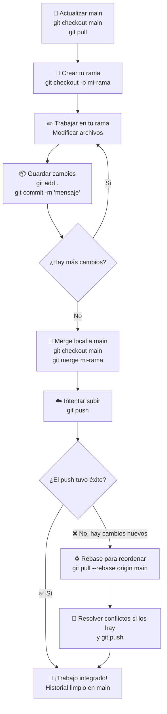

# GitHub: Comandos Esenciales

---

## ¿Qué es Git y GitHub?

- **Git** es una herramienta que se instala en tu ordenador y te permite guardar el historial de cambios de tu código. Es como un sistema de "guardado inteligente" que recuerda cada versión de tu proyecto.
- **GitHub** es una plataforma online donde subes ese código y puedes colaborar con otras personas. Es el servidor remoto donde vive tu proyecto.

> En resumen: **Git** trabaja en local (tu máquina), **GitHub** trabaja en la nube (el servidor).

---

## Comandos Básicos

### `git clone [URL]`

**¿Para qué sirve?** Descarga una copia completa de un repositorio remoto (de GitHub) a tu ordenador. Solo se hace una vez, la primera vez que vas a trabajar con un proyecto.

**¿Cómo se usa?**
```bash
git clone [URL del repositorio]
```

**Ejemplo:**
```bash
git clone git@github.com:paucl/ProgresionAlzheimer.git
```
Esto crea una carpeta llamada `ProgresionAlzheimer` en tu directorio actual con todos los archivos del proyecto.

---

### `git add .` o `git add [archivo]`

**¿Para qué sirve?** Le dice a Git qué cambios quieres incluir en tu próximo "guardado". Piénsalo como seleccionar los archivos que quieres fotografiar antes de hacer la foto.

**¿Cómo funciona?**
- `git add .` — añade **todos** los archivos modificados y nuevos de la carpeta actual.
- `git add [archivo]` — añade **solo ese archivo** específico.

**Ejemplos:**
```bash
# Añadir todos los cambios
git add .

# Añadir solo un archivo concreto
git add modelo_alzheimer.py
```

> Tip: antes de `git add`, puedes usar `git status` para ver qué archivos han cambiado.

---

### `git commit -m "Mensaje"`

**¿Para qué sirve?** Guarda una instantánea de los cambios que añadiste con `git add`. Es el "guardado oficial" con una descripción de qué hiciste.

**Importancia del mensaje:** El mensaje debe ser claro y descriptivo. Será el historial que tú y tu equipo consultaréis para entender qué cambió y por qué. Un buen mensaje ahorra mucho tiempo.

**Ejemplos:**
```bash
# Mensaje claro y descriptivo
git commit -m "feat: añadir preprocesamiento de datos MMSE"

# Otro ejemplo
git commit -m "fix: corregir error en la función de transición de estados"
```

> Evita mensajes vagos como `"cambios"` o `"arreglado"`. Sé específico.

---

### `git push`

**¿Para qué sirve?** Sube tus commits locales al repositorio remoto en GitHub para que el resto del equipo pueda verlos.

**¿Cuándo se usa?** Después de fusionar tu trabajo en `main` localmente y querer compartirlo con el equipo.

**Ejemplo:**
```bash
git push
```

---

### `git pull`

**¿Para qué sirve?** Descarga y aplica los últimos cambios del repositorio remoto a tu copia local. Sirve para mantener tu código actualizado con lo que el equipo ha subido.

**¿Cuándo se usa?** Antes de empezar a trabajar cada día, y siempre antes de fusionar tu rama con `main`.

**Ejemplo:**
```bash
git pull
```

> Haz `git pull` siempre antes de ponerte a trabajar para evitar conflictos innecesarios.

---

---

# Flujo de Trabajo: Integración Directa a Main

## ¿Cómo organizamos el trabajo en equipo?

Cada persona trabaja en su propia rama para mantener sus cambios organizados y no interferir con el trabajo de los demás. Cuando el trabajo está listo, se fusiona directamente en `main` desde tu propio ordenador y se sube. No hay pasos intermedios en la web de GitHub.

Este flujo es ágil, limpio y mantiene el historial del proyecto ordenado.

---

## Diagrama del Flujo de Trabajo



---

## Flujo de Trabajo Paso a Paso

### Paso 1 — Crear tu rama

Siempre parte de un `main` actualizado:

```bash
git checkout main
git pull
git checkout -b nombre-de-tu-rama
```

- `git checkout main` — cambia a la rama principal.
- `git pull` — descarga los últimos cambios del equipo.
- `git checkout -b nombre-de-tu-rama` — crea tu rama y cambia a ella en un solo paso.

**Ejemplos de buenos nombres de rama:**
```bash
git checkout -b feature/modelo-hmm
git checkout -b fix/error-carga-datos
git checkout -b pau/analisis-exploratorio
```

---

### Paso 2 — Trabajar y guardar cambios en tu rama

Modifica los archivos que necesites. Cuando quieras guardar tu progreso:

```bash
git add .
git commit -m "feat: implementar función de predicción de estado"
```

Repite este ciclo (`add` → `commit`) tantas veces como necesites. Cada commit es un punto de guardado en tu historial.

---

### Paso 3 — Actualizar main y hacer el merge local

Antes de fusionar, asegúrate de que tu `main` local esté al día con lo que ha subido el equipo:

```bash
git checkout main
git pull
```

Ahora fusiona tu rama en `main` localmente:

```bash
git merge nombre-de-tu-rama
```

Esto une tus cambios con los de `main` directamente en tu ordenador, sin pasar por la web de GitHub.

---

### Paso 4 — Subir los cambios

```bash
git push
```

Sube el `main` actualizado (con tu trabajo ya integrado) al repositorio remoto.

---

## Manejo de Errores: ¿Qué pasa si el `push` falla?

Si alguien del equipo subió cambios a `main` mientras tú trabajabas, Git te avisará con un error similar a:

```
! [rejected]  main -> main (fetch first)
error: failed to push some refs to 'git@github.com:...'
hint: Updates were rejected because the remote contains work that you do
hint: not have locally.
```

**Solución:** usa `git pull --rebase` en lugar de un `git pull` normal.

```bash
git pull --rebase origin main
```

**¿Qué hace `--rebase`?**
En lugar de crear un commit de fusión extra (que ensucia el historial), el rebase "reordena" tus commits y los pone *encima* de los nuevos cambios que bajaron. El resultado es un historial lineal y limpio, como si hubieras empezado a trabajar justo después de que tu compañero/a subiera sus cambios.

```
Sin rebase:   A - B - C - M   (M = merge commit innecesario)
                  \   /
                   D - E

Con rebase:   A - B - C - D' - E'  (historial limpio y lineal)
```

Después del rebase, simplemente:

```bash
git push
```

---

## Si hay conflictos durante el rebase

Si dos personas modificaron el mismo archivo en el mismo lugar, Git pausará el rebase y te pedirá que resuelvas el conflicto manualmente.

**1.** Git marcará los conflictos en los archivos afectados:
```
<<<<<<< HEAD (cambios de main)
código que subió tu compañero/a
=======
tu código
>>>>>>> tu-commit
```

**2.** Edita el archivo: elimina las marcas (`<<<<<<<`, `=======`, `>>>>>>>`) y deja el código final correcto.

**3.** Marca el conflicto como resuelto y continúa el rebase:
```bash
git add archivo_con_conflicto.py
git rebase --continue
```

**4.** Cuando el rebase termine, sube los cambios:
```bash
git push
```

> Tip: hacer `git pull` al comienzo de cada jornada reduce mucho la probabilidad de conflictos.

---

## Resumen Rápido de Comandos

| Comando | ¿Qué hace? |
|---|---|
| `git clone [URL]` | Descarga el repositorio por primera vez |
| `git checkout main` | Cambia a la rama `main` |
| `git pull` | Actualiza tu copia local con los últimos cambios |
| `git checkout -b [rama]` | Crea y cambia a una nueva rama |
| `git branch` | Lista las ramas locales |
| `git add .` | Prepara todos los cambios para el commit |
| `git commit -m "msg"` | Guarda los cambios con un mensaje |
| `git merge [rama]` | Fusiona una rama en la rama actual |
| `git push` | Sube los commits al remoto |
| `git pull --rebase origin main` | Baja cambios nuevos y reordena tus commits encima |
| `git rebase --continue` | Continúa el rebase tras resolver un conflicto |
| `git status` | Muestra el estado actual de los archivos |
